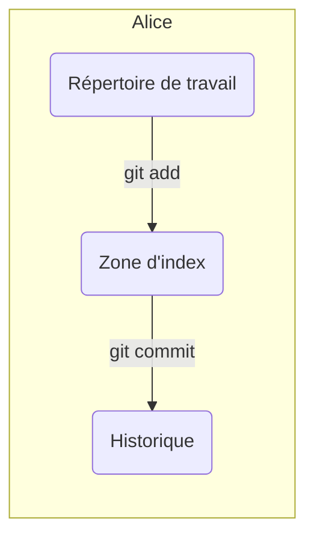
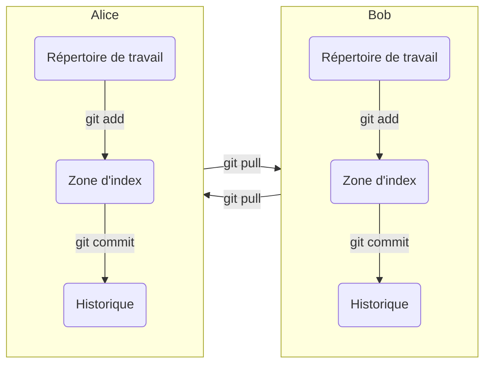
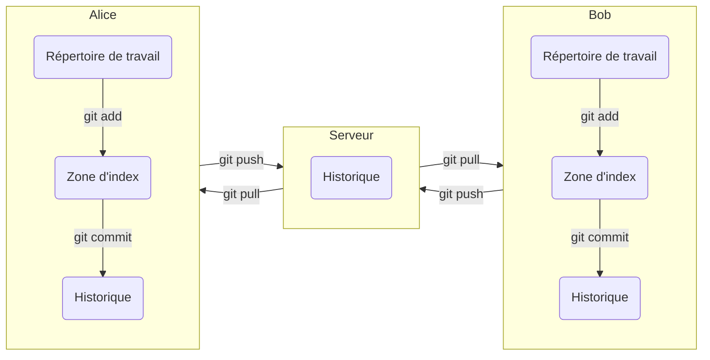
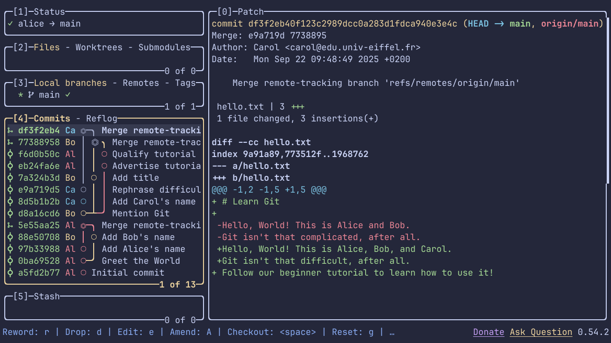

<!--
  PLEASE DO NOT REFORMAT AUTOMATICALLY
  ------------------------------------
  This document uses semantic line breaks
  to simplify editing and version control.
  Further information can be found at:
  https://sembr.org/
-->

# `git init`: Initiation à Git avec Alice et Bob

Dans ce tutoriel,
vous apprendrez à utiliser Git,
un outil de gestion de versions décentralisé.
Il vous permettra
de collaborer efficacement avec vos collègues
sur des projets de programmation
et de conserver un historique des versions de votre code.
Tous vos échanges de fichiers pourront ainsi passer par Git
plutôt que par des canaux mal adaptés
tels que Discord ou les emails.

La prise en main de Git est loin d'être évidente,
mais l'effort d'apprentissage sera vite rentabilisé:
Git est aujourd'hui
un outil incontournable dans le monde du développement informatique.
Vous serez amenés à l'utiliser régulièrement
au cours de vos études,
et très probablement dans votre vie professionnelle
si vous poursuivez dans ce domaine.

Nous supposerons
qu'il s'agit de votre premier contact avec Git
et que vous travaillez sur les machines de l'université
(sur lesquelles Git est déjà installé).
Si vous travaillez sur une machine personnelle,
vérifiez d'abord si vous avez Git,
et installez-le le cas échéant.
Vous trouverez des instructions sur le
[site web officiel](https://git-scm.com/downloads).

## Configuration de Git

Avant de commencer à utiliser Git,
il est recommandé de le configurer.
Pour ce faire,
ouvrez une fenêtre de terminal
et saisissez les commandes indiquées ci-dessous.
La chaîne de caractères `~$` représente
l'invite de commande affichée par le système.
Elle ne fait pas partie des commandes
et ne doit donc **pas être saisie**.

### Votre identité (nom et adresse email)

```shell
~$ git config --global user.name "Prénom Nom"
~$ git config --global user.email "email@example.com"
```

Il est préférable de renseigner ici
votre nom réel et l'adresse email
que vous utiliserez ultérieurement
sur la plateforme en ligne GitHub.

### Votre éditeur de texte

```shell
~$ git config --global core.editor gnome-text-editor
```

Vous pouvez indiquer l'éditeur de texte de votre choix ici
(mais veillez à sélectionner un éditeur de texte **brut**,
et non un logiciel de traitement de texte
comme Microsoft Word ou LibreOffice Writer).
C'est cet éditeur qui sera ouvert automatiquement
lorsque Git vous demandera de saisir un message.
Si vous ne savez pas lequel choisir,
utilisez `gnome-text-editor` pour le moment.

### Le nom de la branche par défaut

```shell
~$ git config --global init.defaultBranch main
```

Beaucoup de services en ligne (notamment GitHub)
utilisent `main` comme nom de branche par défaut.
Pour être cohérents,
nous suivons la même convention ici.

### Vérifiez votre configuration

Les paramètres que vous avez saisis ci-dessus
sont stockés dans le fichier caché `.gitconfig`
de votre répertoire personnel `~`.
Vous pouvez afficher le contenu de ce fichier directement
avec la commande `cat`:

```shell
~$ cat ~/.gitconfig
```

```console
[user]
  name = Prénom Nom
  email = email@example.com
[core]
  editor = gnome-text-editor
[init]
  defaultBranch = main
```

Alternativement,
vous pouvez demander à Git d'afficher
les informations récupérées à partir de ce fichier:

```shell
~$ git config --list --global
```

```console
user.name=Prénom Nom
user.email=email@example.com
core.editor=gnome-text-editor
init.defaultbranch=main
```

Les lignes qui ne commencent pas par une invite de commande comme `~$`
représentent la sortie de la commande qui les précède.
Par exemple,
la première ligne affichée
par la commande `git config --list --global`
est `user.name=Prénom Nom`.

## Alice travaille en solo



Vous allez maintenant jouer à un petit jeu de rôle.
Dans un premier temps,
vous incarnerez le rôle d'Alice.
Pour cela,
créez un nouveau répertoire nommé `alice` et placez-vous dedans:

```shell
~$ mkdir alice
~$ cd alice
```

Créez ensuite un nouveau fichier texte nommé `hello.txt`
et écrivez-y un message
à l'aide de l'éditeur de texte de votre choix.
Par exemple:

```shell
~/alice$ gnome-text-editor hello.txt
```

Notez que l'invite de commande est maintenant `~/alice$` au lieu de `~$`,
ce qui indique que vous êtes actuellement dans le sous-répertoire `alice`
de votre répertoire personnel `~`.

Après avoir enregistré le fichier et fermé l'éditeur,
vous pouvez vérifier le contenu du fichier
avec la commande `cat`:

```shell
~/alice$ cat hello.txt
```

```console
Hello!
```

(Évidemment,
vous pouvez aussi garder l'éditeur ouvert dans une fenêtre à part,
mais pour simplifier la présentation,
nous supposerons ici que
l'éditeur est ouvert à partir du terminal pour chaque modification,
puis refermé une fois le fichier modifié et enregistré.
Dans la suite,
nous utiliserons souvent la commande `cat`
pour vous montrer l'état actuel du fichier.
Si vous voyez le fichier dans votre éditeur,
ceci est bien sûr inutile.)

### Créez un dépôt Git

Avant de poursuivre son travail sur le fichier `hello.txt`,
Alice souhaite mettre en place un dépôt Git
pour faciliter le versionnage de son projet et,
plus tard,
la collaboration avec son ami Bob.
Pour ce faire,
commencez par créer un dépôt Git vide
dans le sous-répertoire `alice`.

```shell
~/alice$ git init
```

```console
Initialized empty Git repository in ~/alice/.git/
```

Comme l'indique le message affiché,
cette commande crée un sous-répertoire caché nommé `.git`.
Vous pouvez vérifier cela en listant le contenu du répertoire courant
avec la commande `ls`
(l'option `-A` indique d'inclure les fichiers cachés,
dont le nom commence par un point):

```shell
~/alice$ ls -A
```

```console
.git  hello.txt
```

On retrouve le fichier `hello.txt` créé précédemment,
ainsi que le nouveau sous-répertoire `.git`.
C'est dans ce dernier que Git stockera
l'historique de versionnage et la configuration locale du projet d'Alice.

Pour rendre le jeu de rôle un peu plus réaliste,
changez votre identité localement pour ce projet:

```shell
~/alice$ git config --local user.name "Alice"
~/alice$ git config --local user.email "alice@edu.univ-eiffel.fr"
```

Notez ici l'utilisation de l'option `--local` au lieu de `--global`.
Les paramètres configurés localement
sont stockés dans le fichier `config`
du sous-répertoire `.git`:

```shell
~/alice$ cat .git/config
```

```console
[core]
  ...
[user]
  name = Alice
  email = alice@edu.univ-eiffel.fr
```

### Votre premier commit

Maintenant,
Alice souhaite enregistrer la version actuelle du fichier `hello.txt`
dans l'historique de Git.

Commencez par déterminer l'état du répertoire de travail:

```shell
~/alice$ git status
```

```console
On branch main

No commits yet

Untracked files:
  (use "git add <file>..." to include in what will be committed)
  hello.txt

nothing added to commit but untracked files present (use "git add" to track)
```

Le message indique que
le fichier `hello.txt` n'est actuellement pas suivi par Git.
Il indique également la commande que vous devez saisir pour changer cela:

```shell
~/alice$ git add hello.txt
```

Si vous lancez à nouveau la commande `git status`,
vous pouvez constater que le fichier est maintenant suivi et indexé:

```shell
~/alice$ git status
```

```console
On branch main

No commits yet

Changes to be committed:
  (use "git rm --cached <file>..." to unstage)
  new file:   hello.txt
```

Cependant,
le message `No commits yet` vous informe que
vous n'avez toujours rien enregistré dans l'historique.
Pour le moment,
le fichier `hello.txt`
a seulement été ajouté à la *zone d'index*.
Cette zone représente un espace intermédiaire
dans lequel vous ajoutez les modifications
que vous souhaitez ensuite enregistrer dans l'historique.
Ce processus en deux étapes peut s'avérer très utile
dans des cas plus complexes,
lorsque vous avez effectué de nombreuses modifications
et que vous souhaitez les enregistrer séparément.
Mais pour le moment,
nous restons sur un cas très simple.

Enregistrez maintenant la première version du projet:

```shell
~/alice$ git commit -m "Initial commit"
```

```console
[main (root-commit) a5fd2b7] Initial commit
 1 file changed, 1 insertion(+)
 create mode 100644 hello.txt
```

Dans Git,
une telle version s'appelle un *commit*.
La chaîne de caractères `"Initial commit"` est un message
qui décrit brièvement les changements introduits par le commit.
Ce message est destiné aux personnes qui visualiseront l'historique
(donc à vos collègues et à vous-même).
Ici,
le message a été passé directement dans la ligne de commande.
Alternativement,
vous pouvez lancer la même commande sans options:

```shell
~/alice$ git commit
```

Dans ce cas,
Git ouvre automatiquement l'éditeur de texte
que vous avez configuré précédemment,
et vous devez saisir votre message dans la première ligne.
(Les lignes commençant par `#` sont des commentaires informatifs
qui seront ignorés par Git.)
Une fois le fichier enregistré et l'éditeur fermé,
le commit est enregistré dans l'historique.

### Visualisez l'historique

À tout moment,
vous pouvez afficher l'historique avec la commande `git log`:

```shell
~/alice$ git log
```

```console
commit a5fd2b774f1b30481bd760715ed911253d4f4cbe (HEAD -> main)
Author: Alice <alice@edu.univ-eiffel.fr>
Date:   Tue Sep 9 10:53:04 2025 +0200

    Initial commit
```

Ici,
la chaîne de caractères `a5fd2b774f1b30481bd760715ed911253d4f4cbe`
représente un nombre appelé *valeur de hachage*,
que Git calcule pour identifier votre commit.
En général,
les sept premiers caractères (`a5fd2b7`)
suffisent à identifier le commit de manière unique.

Dans la suite,
nous ajouterons généralement quelques options à la commande `git log`
pour obtenir une visualisation plus compacte
qui représente toutes les branches de l'historique
sous forme pseudo-graphique:

```shell
~/alice$ git log --oneline --all --graph
```

```console
* a5fd2b7 (HEAD -> main) Initial commit
```

Pour l'instant,
le graphe de l'historique ne contient qu'un seul sommet,
mais cette représentation prendra tout son intérêt
lorsque le graphe comprendra des branchements.

Pour éviter de devoir saisir
les options `--oneline`, `--all`, et `--graph` à chaque fois,
définissez un alias:

```shell
~/alice$ git config --global alias.graph "log --oneline --all --graph"
```

Vous pouvez désormais utiliser la commande `git graph`,
que vous venez de créer,
au lieu de `git log --oneline --all --graph`:

```shell
~/alice$ git graph
```

```console
* a5fd2b7 (HEAD -> main) Initial commit
```

### Votre deuxième commit

Avec le système de versionnage en place,
Alice se sent désormais plus sereine
pour modifier son travail existant.

Modifiez le fichier `hello.txt`:

```shell
~/alice$ gnome-text-editor hello.txt
~/alice$ cat hello.txt
```

```console
Hello, World!
```

Puis,
affichez le statut du répertoire de travail:

```shell
~/alice$ git status
```

```console
On branch main
Changes not staged for commit:
  (use "git add <file>..." to update what will be committed)
  (use "git restore <file>..." to discard changes in working directory)
  modified:   hello.txt

no changes added to commit (use "git add" and/or "git commit -a")
```

Git a bien détecté vos modifications.
Pour vérifier ce qui a changé exactement,
utilisez la commande `git diff`:

```shell
~/alice$ git diff
```

```console
diff --git a/hello.txt b/hello.txt
index 10ddd6d..8ab686e 100644
--- a/hello.txt
+++ b/hello.txt
@@ -1 +1 @@
-Hello!
+Hello, World!
```

On voit que la ligne `Hello!` a été remplacée par `Hello, World!`.
Satisfaite de ce progrès,
Alice souhaite enregistrer une nouvelle version dans l'historique.

Ajoutez d'abord les modifications à la zone d'index:

```shell
~/alice$ git add hello.txt
```

Notez qu'il s'agit de la même commande
que vous avez utilisée
pour ajouter le fichier la première fois,
alors qu'il n'était pas encore suivi par Git.
Conceptuellement,
vous n'ajoutez pas le fichier lui-même à la zone d'index,
mais les modifications qui y ont été apportées
depuis le dernier commit.

(La commande n'affiche aucun message,
car sous Unix, pas de nouvelles, bonnes nouvelles.
Si vous avez un doute,
vous pouvez toujours relancer `git status`
pour vérifier que vos modifications ont bien été indexées.)

Puis,
créez votre deuxième commit:

```shell
~/alice$ git commit -m "Greet the World"
```

```console
[main 0ba6952] Greet the World
 1 file changed, 1 insertion(+), 1 deletion(-)
```

Le commit apparaît maintenant dans le graphe de l'historique:

```shell
~/alice$ git graph
```

```console
* 0ba6952 (HEAD -> main) Greet the World
* a5fd2b7 Initial commit
```

### Récupérez une ancienne version

Dans le graphe ci-dessus,
il y a deux pointeurs: `main` et `HEAD`.

* `main` est le nom de la branche principale
(qui, dans ce tutoriel, est aussi la seule branche).
Ce pointeur pointe toujours vers
le commit le plus récent de la branche
(ici, `0ba6952`).

* `HEAD` est un pointeur spécial
qui représente l'état courant du dépôt,
c'est-à-dire le commit sur lequel vous travaillez actuellement.
En général,
`HEAD` pointe vers la branche active
(ici, `main`).
Il est toutefois possible de le faire pointer
directement vers un commit,
ce qui peut être pratique
lorsque vous souhaitez accéder temporairement à une ancienne version.

Vous pouvez déplacer le pointeur `HEAD`
à l'aide de la commande `git switch`.
Cela vous permet de récupérer les fichiers du commit précédent:

```shell
~/alice$ git switch --detach a5fd2b7
```

```console
HEAD is now at a5fd2b7 Initial commit
```

Le contenu de `hello.txt` est revenu à sa version initiale:

```shell
~/alice$ cat hello.txt
```

```console
Hello!
```

Et `HEAD` pointe maintenant directement vers le commit `a5fd2b7`:

```shell
~/alice$ git graph
```

```console
* 0ba6952 (main) Greet the World
* a5fd2b7 (HEAD) Initial commit
```

Cet état est communément appelé “`HEAD` détaché”.
La commande `git status` vous le rappelle:

```shell
~/alice$ git status
```

```console
HEAD detached at a5fd2b7
nothing to commit, working tree clean
```

Il est déconseillé d'effectuer un nouveau commit
lorsque vous êtes dans un état “`HEAD` détaché”,
car un tel commit n'appartiendrait à aucune branche nommée
et pourrait ainsi facilement être perdu.
(C'est pour cette raison que
la commande `git switch` nécessitait l'option `--detach`
avant de vous mettre dans cet état.)

Pour revenir à la version actuelle du projet,
il suffit de rebasculer sur `main`:

```shell
~/alice$ git switch main
```

```console
Previous HEAD position was a5fd2b7 Initial commit
Switched to branch 'main'
```

Tout est désormais comme avant:

```shell
~/alice$ cat hello.txt
```

```console
Hello, World!
```

```shell
~/alice$ git graph
```

```console
* 0ba6952 (HEAD -> main) Greet the World
* a5fd2b7 Initial commit
```

## Bob rejoint le projet



Nous poursuivons notre jeu de rôle.
Vous incarnerez maintenant le rôle de Bob,
qui aimerait collaborer avec Alice sur le même projet.

### Clonez le projet

Ouvrez une deuxième fenêtre de terminal
(la fenêtre d'Alice vous servira encore plus tard),
et utilisez la commande `git clone`
pour créer une copie du projet d'Alice:

```shell
~$ git clone alice bob
```

```console
Cloning into 'bob'...
done.
```

Vous venez de créer un nouveau sous-répertoire nommé `bob`.
Celui-ci contient les mêmes fichiers que `alice`:

```shell
~$ cd bob
~/bob$ ls -A
```

```console
.git  hello.txt
```

```shell
~/bob$ cat hello.txt
```

```console
Hello, World!
```

Le répertoire `bob`
contient également l'historique complet du projet:

```shell
~/bob$ git graph
```

```console
* 0ba6952 (HEAD -> main, origin/main, origin/HEAD) Greet the World
* a5fd2b7 Initial commit
```

Mais il faut bien comprendre qu'il s'agit de la copie locale de Bob.
Celui-ci est donc libre d'y apporter les changements qu'il souhaite.
Il dispose de ses propres pointeurs `main` et `HEAD`,
indépendants de ceux d'Alice.
En revanche,
le pointeur `origin/main` représente le pointeur `main` d'Alice,
et `origin/HEAD` représente la branche par défaut d'Alice
(qui ne coïncide pas nécessairement avec son pointeur `HEAD` ...).
Pour éviter toute confusion,
supprimez `origin/HEAD`,
et renommez `origin` en `alice`:

```shell
~/bob$ git remote set-head origin --delete
~/bob$ git remote rename origin alice
```

```console
Renaming remote references: 100% (1/1), done.
```

```shell
~/bob$ git graph
```

```console
* 0ba6952 (HEAD -> main, alice/main) Greet the World
* a5fd2b7 Initial commit
```

Changez également l'identité locale du projet,
afin de pouvoir facilement reconnaître les commits créés par Bob.

```shell
~/bob$ git config --local user.name "Bob"
~/bob$ git config --local user.email "bob@edu.univ-eiffel.fr"
```

### Contribuez en tant que Bob

Bob décide d'apporter sa première contribution au projet.

Modifiez le fichier `hello.txt` de Bob
(pas celui d'Alice):

```shell
~/bob$ gnome-text-editor hello.txt
~/bob$ cat hello.txt
```

```console
Hello, World! This is Bob.
```

Ajoutez les modifications à la zone d'index:

```shell
~/bob$ git add hello.txt
```

Créez le premier commit de Bob:

```shell
~/bob$ git commit -m "Add Bob's name"
```

```console
[main 88e5070] Add Bob's name
 1 file changed, 1 insertion(+), 1 deletion(-)
```

Visualisez l'historique:

```shell
~/bob$ git graph
```

```console
* 88e5070 (HEAD -> main) Add Bob's name
* 0ba6952 (alice/main) Greet the World
* a5fd2b7 Initial commit
```

Pour voir l'auteur de chaque commit,
vous pouvez ajouter l'option `--pretty=short`:

```shell
~/bob$ git graph --pretty=short
```

```console
* commit 88e5070 (HEAD -> main)
| Author: Bob <bob@edu.univ-eiffel.fr>
|
|     Add Bob's name
|
* commit 0ba6952 (alice/main)
| Author: Alice <alice@edu.univ-eiffel.fr>
|
|     Greet the World
|
* commit a5fd2b7
  Author: Alice <alice@edu.univ-eiffel.fr>

      Initial commit
```

## Du côté d'Alice

En parallèle,
Alice poursuit le travail sur sa propre copie du projet.
Retournez à la première fenêtre de terminal.
(Si vous l'avez fermée,
ouvrez-en une nouvelle
et placez-vous dans le répertoire d'Alice
avec la commande `cd alice`.)

### Un autre commit

Remodifiez le fichier `hello.txt` d'Alice
(pas celui de Bob),
puis enregistrez les modifications dans un nouveau commit:

```shell
~/alice$ gnome-text-editor hello.txt
~/alice$ cat hello.txt
```

```console
Hello, World! This is Alice.
```

```shell
~/alice$ git add hello.txt
~/alice$ git commit -m "Add Alice's name"
```

```console
[main 97b3398] Add Alice's name
 1 file changed, 1 insertion(+), 1 deletion(-)
```

```shell
~/alice$ git graph
```

```console
* 97b3398 (HEAD -> main) Add Alice's name
* 0ba6952 Greet the World
* a5fd2b7 Initial commit
```

### Votre première divergence

Maintenant,
Alice aimerait voir ce que Bob a fait entre-temps.
Pour ce faire,
commencez par ajouter le dépôt de Bob comme un dépôt distant:

```shell
~/alice$ git remote add bob ~/bob
```

Puis,
récupérez les commits de la branche `main` de Bob
qu'Alice n'a pas encore:

```shell
~/alice$ git pull bob main
```

```console
From ~/bob
 * branch            main       -> FETCH_HEAD
 * [new branch]      main       -> bob/main
hint: You have divergent branches and need to specify how to reconcile them.
hint: You can do so by running one of the following commands sometime before
hint: your next pull:
hint:
hint:   git config pull.rebase false  # merge
hint:   git config pull.rebase true   # rebase
hint:   git config pull.ff only       # fast-forward only
hint:
hint: You can replace "git config" with "git config --global" to set a default
hint: preference for all repositories. You can also pass --rebase, --no-rebase,
hint: or --ff-only on the command line to override the configured default per
hint: invocation.
fatal: Need to specify how to reconcile divergent branches.
```

Mince!
Un tel message d'erreur peut faire peur.

Ce que Git essaie de vous dire,
c'est que les branches `main` d'Alice et de Bob ont divergé,
et que vous ne lui avez pas indiqué
comment vous souhaitez gérer ce genre de situation.

L'option la plus sûre consiste à
laisser Git gérer automatiquement seulement les cas les plus simples,
où la branche distante est en avance sur la branche locale,
sans qu'il y ait eu de divergence
(“fast-forward only”).
Pour configurer cette option à l'échelle globale,
utilisez la commande suivante:

```shell
~/alice$ git config --global pull.ff only

```

Relancez maintenant la commande précédente:

```shell
~/alice$ git pull bob main
```

```console
From ~/bob
 * branch            main       -> FETCH_HEAD
fatal: Not possible to fast-forward, aborting.
```

La notice explicative a disparu,
puisque Git sait désormais
qu'il ne doit jamais essayer de gérer les divergences automatiquement
lorsque vous récupérez des commits depuis un dépôt distant.
En revanche,
vous obtenez maintenant un message d'erreur
indiquant une situation de divergence.

Pour mieux comprendre cette situation,
visualisez le graphe des commits:

```shell
~/alice$ git graph
```

```console
* 97b3398 (HEAD -> main) Add Alice's name
| * 88e5070 (bob/main) Add Bob's name
|/
* 0ba6952 Greet the World
* a5fd2b7 Initial commit
```

On voit bien le problème:
pour Alice,
le commit le plus récent de la branche `main` est `97b3398`,
mais pour Bob,
c'est `88e5070`.

### Votre premier conflit

Pour résoudre ce problème,
la solution la plus simple consiste à ajouter un nouveau commit
qui fusionne les commits divergents.
Un tel commit de fusion
(ou “merge commit” en anglais)
a la particularité de posséder plusieurs parents
(généralement deux).

Essayez de fusionner la branche `main` d'Alice avec celle de Bob:

```shell
~/alice$ git merge bob/main
```

```console
Auto-merging hello.txt
CONFLICT (content): Merge conflict in hello.txt
Recorded preimage for 'hello.txt'
Automatic merge failed; fix conflicts and then commit the result.
```

Mince,
encore une erreur!
Souvent,
Git est capable de fusionner les branches automatiquement.
Mais ici,
ce n'est pas possible,
car Alice et Bob ont modifié la même ligne du fichier `hello.txt`.
On appelle une telle situation
un conflit de fusion
(ou “merge conflict” en anglais).

Pas de panique,
c'est une situation tout à fait normale
qui survient tout le temps en pratique.
Quand vous ne savez pas comment la gérer,
regardez l'état courant du répertoire de travail.
Parfois,
Git vous donne des conseils utiles,
comme ici:

```shell
~/alice$ git status
```

```console
On branch main
You have unmerged paths.
  (fix conflicts and run "git commit")
  (use "git merge --abort" to abort the merge)

Unmerged paths:
  (use "git add <file>..." to mark resolution)
  both modified:   hello.txt

no changes added to commit (use "git add" and/or "git commit -a")
```

Ce message vous informe que
vous êtes en train d'effectuer une opération de fusion.
Vous pourriez abandonner cette opération
avec la commande `git merge --abort`,
mais ce n'est pas ce qu'Alice veut faire ici.
Git vous propose de résoudre le conflit manuellement,
puis d'enregistrer un nouveau commit de fusion
à l'aide de la commande `git commit`
que vous connaissez déjà.

Le conflit est immédiatement visible en regardant le fichier:

```shell
~/alice$ cat hello.txt
```

```console
<<<<<<< HEAD
Hello, World! This is Alice.
=======
Hello, World! This is Bob.
>>>>>>> bob/main
```

Git a ajouté des marques de résolution de conflit dans le fichier.
Ce qui se trouve entre les marques `<<<<<<< HEAD` et `=======`
correspond à la version d'Alice,
tandis que ce qui se trouve entre `=======` et `>>>>>>> bob/main`
correspond à la version de Bob.
Git n'a aucun moyen de savoir comment résoudre ce conflit.
Mais pour Alice,
c'est facile.

Éditez le fichier `hello.txt` pour résoudre le conflit,
en prenant soin de supprimer les marques de résolution
ajoutées par Git:

```shell
~/alice$ gnome-text-editor hello.txt
~/alice$ cat hello.txt
```

```console
Hello, World! This is Alice and Bob.
```

Comme précédemment,
vous pouvez vérifier tous les changements
grâce à la commande `git diff`:

```shell
~/alice$ git diff
```

```console
diff --cc hello.txt
index e31e50d,030e28e..0000000
--- a/hello.txt
+++ b/hello.txt
@@@ -1,1 -1,1 +1,1 @@@
- Hello, World! This is Alice.
 -Hello, World! This is Bob.
++Hello, World! This is Alice and Bob.
```

On voit que,
par rapport à la version d'Alice,
on a supprimé la ligne
`Hello, World! This is Alice`,
par rapport à la version de Bob,
on a supprimé la ligne
`Hello, World! This is Bob`,
et par rapport aux deux versions,
on a ajouté la ligne
`Hello, World! This is Alice and Bob`.
Autrement dit,
on a fusionné les lignes d'Alice et de Bob en une seule ligne.

Comme indiqué dans le message précédent de `git status`,
vous devez maintenant marquer le conflit comme résolu
en utilisant la commande `git add`:

```shell
~/alice$ git add hello.txt
```

Comme souvent,
il n'y a pas de retour quand tout se passe bien,
mais vous pouvez voir votre progrès à l'aide de `git status`:

```shell
~/alice$ git status
```

```console
On branch main
All conflicts fixed but you are still merging.
  (use "git commit" to conclude merge)

Changes to be committed:
  modified:   hello.txt
```

Ce message vous informe
que votre opération de fusion n'est pas encore finalisée.
C'est normal,
car jusque-là,
vous avez préparé le commit de fusion
dans la zone d'index avec `git add`,
mais vous ne l'avez pas encore enregistré dans l'historique.

Pour finaliser la fusion,
il vous suffit de suivre le conseil de Git:

```shell
~/alice$ git commit
```

Cela ouvre automatiquement votre éditeur de texte,
pré-rempli avec le message de commit par défaut
`Merge remote-tracking branch 'bob/main'`.
Après avoir enregistré le fichier et fermé l'éditeur,
vous voyez un message de la forme suivante,
et l'opération de fusion est enfin terminée:

```console
Recorded resolution for 'hello.txt'.
[main 5e55aa2] Merge remote-tracking branch 'bob/main'
```

Si vous avez un doute,
vous pouvez relancer `git status`
pour vérifier que vous n'avez plus rien à faire:

```shell
~/alice$ git status
```

```console
On branch main
nothing to commit, working tree clean
```

Et vous pouvez finalement contempler les fruits de votre travail:

```shell
~/alice$ git graph
```

```console
*   5e55aa2 (HEAD -> main) Merge remote-tracking branch 'bob/main'
|\
| * 88e5070 (bob/main) Add Bob's name
* | 97b3398 Add Alice's name
|/
* 0ba6952 Greet the World
* a5fd2b7 Initial commit
```

## De retour chez Bob

Bob a fait une pause café entre-temps.
Sa copie du dépôt n'a donc pas changé,
comme vous pouvez le vérifier
dans votre deuxième fenêtre de terminal:

```shell
~/bob$ git graph
```

```console
* 88e5070 (HEAD -> main) Add Bob's name
* 0ba6952 (alice/main) Greet the World
* a5fd2b7 Initial commit
```

Notez que,
selon les dernières informations dont dispose Bob,
la branche `main` d'Alice en est toujours au commit `0ba6952`.

Bob s'apprête à reprendre son travail.
Mais avant de continuer,
il préfère vérifier
s'il y a de nouveaux commits sur la branche `main` d'Alice.
C'est une bonne pratique,
car cela lui évitera de devoir gérer
beaucoup de conflits de fusion par la suite.

```shell
~/bob$ git pull alice main
```

```console
remote: Enumerating objects: 10, done.
remote: Counting objects: 100% (10/10), done.
remote: Compressing objects: 100% (2/2), done.
remote: Total 6 (delta 0), reused 0 (delta 0), pack-reused 0
Unpacking objects: 100% (6/6), 548 bytes | 274.00 KiB/s, done.
From ~/alice
 * branch            main       -> FETCH_HEAD
   0ba6952..5e55aa2  main       -> alice/main
Updating 88e5070..5e55aa2
Fast-forward
 hello.txt | 2 +-
 1 file changed, 1 insertion(+), 1 deletion(-)
```

En effet,
la branche d'Alice avait de l'avance sur la sienne.
Et comme il n'y a pas eu de divergence cette fois-ci,
Git a pu faire un “fast-forward”,
c'est-à-dire simplement avancer le pointeur `main` de Bob
de manière à ce qu'il pointe sur le commit le plus récent.

Maintenant,
Bob voit le même historique qu'Alice:

```shell
~/bob$ git graph
```

```console
*   5e55aa2 (HEAD -> main, alice/main) Merge remote-tracking branch 'bob/main'
|\
| * 88e5070 Add Bob's name
* | 97b3398 Add Alice's name
|/
* 0ba6952 Greet the World
* a5fd2b7 Initial commit
```

## Un serveur simplifie la collaboration



Alice et Bob pourraient mener toute leur collaboration
avec la commande `git pull`,
mais cette approche présente un défaut important
dans un scénario plus réaliste,
où les deux travaillent sur des machines différentes:
pour pouvoir échanger des données,
ils doivent être connectés en même temps.

La solution canonique à ce problème
consiste à échanger les données via un serveur central
plutôt que directement entre les utilisateurs.
Ici,
vous allez simuler ce serveur localement
avec une troisième copie de votre dépôt Git,
mais conceptuellement cela n'est pas différent de
l'utilisation d'un service en ligne comme GitHub.

Ouvrez une troisième fenêtre de terminal,
et créez le serveur:

```shell
~$ git clone --bare alice origin
```

```console
Cloning into bare repository 'origin'...
done.
```

Nous appelons le serveur `origin`,
ce qui correspond à la convention habituelle sous Git.

Notez l'utilisation de l'option `--bare`,
qui n'était pas présente lors de la création du dépôt de Bob.
Cette option indique à Git de créer un nouveau dépôt nu,
c'est-à-dire un dépôt qui ne contient pas de répertoire de travail.
C'est généralement ce que l'on veut pour un serveur,
puisque personne ne travaillera directement sur celui-ci.
Le rôle du serveur se limite à maintenir
une copie centralisée de l'historique du projet.

Dans le sous-répertoire `origin` que vous venez de créer,
vous pouvez vérifier
que le serveur dispose bien de l'historique complet:

```shell
~$ cd origin
~/origin$ git graph
```

```console
*   5e55aa2 (HEAD -> main) Merge remote-tracking branch 'bob/main'
|\
| * 88e5070 Add Bob's name
* | 97b3398 Add Alice's name
|/
* 0ba6952 Greet the World
* a5fd2b7 Initial commit
```

Cependant,
si vous listez le contenu du répertoire,
vous voyez qu'il ne s'agit pas d'un répertoire de travail:

```shell
~/origin$ ls -A
```

```console
branches  config  description  HEAD  hooks  info  objects  packed-refs  refs
```

Au lieu de retrouver le fichier `hello.txt`
et le sous-répertoire caché `.git`
comme dans les dépôts d'Alice et de Bob,
vous voyez une étrange collection de fichiers et de sous-répertoires.
Il s'agit des données internes utilisées par Git
pour représenter l'historique et la configuration du projet.
Ce sont essentiellement les mêmes données
que celles stockées dans
les sous-répertoires `.git` d'Alice et de Bob.

En effet,
si vous retournez à la fenêtre d'Alice,
vous pouvez afficher une liste similaire de fichiers internes
(avec quelques fichiers en plus):

```shell
~/alice$ ls -A .git
```

```console
branches        config       FETCH_HEAD  hooks  info  MERGE_RR  ORIG_HEAD    refs
COMMIT_EDITMSG  description  HEAD        index  logs  objects   packed-refs  rr-cache
```

À partir de maintenant,
tous les échanges de données entre Alice et Bob
passeront par le serveur.

Pour ce faire,
toujours dans la fenêtre d'Alice,
ajoutez le serveur en tant que dépôt distant,
et retirez celui de Bob,
qui ne servira plus:

```shell
~/alice$ git remote add origin ~/origin
~/alice$ git remote remove bob
```

Récupérez l'état actuel du serveur,
ce qui ajoute un nouveau pointeur `origin/main` à votre dépôt:

```shell
~/alice$ git pull origin main
```

```console
From ~/origin
 * branch            main       -> FETCH_HEAD
 * [new branch]      main       -> origin/main
Already up to date.
```

Configurez `origin/main` comme la branche amont de `main`:

```shell
~/alice$ git branch --set-upstream-to=origin/main
```

```console
branch 'main' set up to track 'origin/main'.
```

Avec cette configuration,
`origin/main` devient la branche par défaut
depuis laquelle `main` est mise à jour
(et vers laquelle vos modifications locales sont envoyées).
Ainsi,
vous pouvez désormais utiliser un simple `git pull`
au lieu de `git pull origin main`.

Procédez de manière analogue dans la fenêtre de Bob:

```shell
~/bob$ git remote add origin ~/origin
~/bob$ git remote remove alice
~/bob$ git pull origin main
~/bob$ git branch --set-upstream-to=origin/main
```

### Poussez vers le serveur

En tant que Bob,
modifiez à nouveau le fichier `hello.txt`,
puis ajoutez un nouveau commit à l'historique:

```shell
~/bob$ gnome-text-editor hello.txt
~/bob$ cat hello.txt
```

```console
Hello, World! This is Alice and Bob.
Git isn't that complicated, after all.
```

```shell
~/bob$ git add hello.txt
~/bob$ git commit -m "Mention Git"
```

```console
[main d8a16cd] Mention Git
 1 file changed, 1 insertion(+)
```

Le nouveau commit `d8a16cd`
est maintenant dans le dépôt local de Bob,
mais pas encore sur le serveur,
qui se trouve encore au commit `5e55aa2`:

```shell
~/bob$ git graph
```

```console
* d8a16cd (HEAD -> main) Mention Git
*   5e55aa2 (origin/main) Merge remote-tracking branch 'bob/main'
|\
| * 88e5070 Add Bob's name
* | 97b3398 Add Alice's name
|/
* 0ba6952 Greet the World
* a5fd2b7 Initial commit
```

La commande `git status` vous indique ce que vous devez faire:

```shell
~/bob$ git status
```

```console
On branch main
Your branch is ahead of 'origin/main' by 1 commit.
  (use "git push" to publish your local commits)

nothing to commit, working tree clean
```

Pour partager les changements avec Alice,
vous devez les pousser vers le serveur:

```shell
~/bob$ git push
```

```console
Enumerating objects: 5, done.
Counting objects: 100% (5/5), done.
Delta compression using up to 8 threads
Compressing objects: 100% (2/2), done.
Writing objects: 100% (3/3), 313 bytes | 313.00 KiB/s, done.
Total 3 (delta 0), reused 0 (delta 0), pack-reused 0
To ~/origin
   5e55aa2..d8a16cd  main -> main
```

Vérifiez dans la fenêtre du serveur
que celui-ci a bien été reçu la mise à jour:

```shell
~/origin$ git graph
```

```console
* d8a16cd (HEAD -> main) Mention Git
*   5e55aa2 Merge remote-tracking branch 'bob/main'
|\
| * 88e5070 Add Bob's name
* | 97b3398 Add Alice's name
|/
* 0ba6952 Greet the World
* a5fd2b7 Initial commit
```

### Tirez depuis le serveur

Alice,
quant à elle,
est toujours au commit `5e55aa2`:

```shell
~/alice$ git graph
```

```console
*   5e55aa2 (HEAD -> main, origin/main) Merge remote-tracking branch 'bob/main'
|\
| * 88e5070 Add Bob's name
* | 97b3398 Add Alice's name
|/
* 0ba6952 Greet the World
* a5fd2b7 Initial commit
```

Notez que même le pointeur `origin/main` d'Alice
est resté au commit `5e55aa2`.
Ce pointeur représente le dernier état connu du serveur.
Puisqu'Alice n'a plus communiqué avec le serveur
depuis la dernière mise à jour de Bob,
ses informations locales sont obsolètes.

Pour mettre à jour le dépôt d'Alice,
utilisez la commande `git pull`:

```shell
~/alice$ git pull
```

```console
remote: Enumerating objects: 5, done.
remote: Counting objects: 100% (5/5), done.
remote: Compressing objects: 100% (2/2), done.
remote: Total 3 (delta 0), reused 0 (delta 0), pack-reused 0
Unpacking objects: 100% (3/3), 293 bytes | 146.00 KiB/s, done.
From ~/origin
   5e55aa2..d8a16cd  main       -> origin/main
Updating 5e55aa2..d8a16cd
Fast-forward
 hello.txt | 1 +
 1 file changed, 1 insertion(+)
```

Maintenant,
Alice voit la même chose que Bob et que le serveur:

```shell
~/alice$ git graph
```

```console
* d8a16cd (HEAD -> main, origin/main) Mention Git
*   5e55aa2 Merge remote-tracking branch 'bob/main'
|\
| * 88e5070 Add Bob's name
* | 97b3398 Add Alice's name
|/
* 0ba6952 Greet the World
* a5fd2b7 Initial commit
```

## À vous de jouer

En vous inspirant des sections précédentes,
poursuivez le jeu de rôle comme bon vous semble
pour bien assimiler les commandes Git
que vous venez de découvrir.

Vous pouvez par exemple
ouvrir une nouvelle fenêtre de terminal
et ajouter une troisième personne,
Carol,
qui dispose elle aussi de sa propre copie du dépôt:

```shell
~$ git clone origin carol
~$ cd carol
~/carol$ git config --local user.name "Carol"
~/carol$ git config --local user.email "carol@edu.univ-eiffel.fr"
```

Essayez de simuler une collaboration réelle,
avec des utilisateurs qui travaillent en parallèle
sans toujours être conscients de ce que font les autres.
N'ayez pas peur de créer
des divergences et des conflits
(en laissant plusieurs utilisateurs modifier les mêmes lignes).
Ce sont justement ce genre de situations
qui se produiront tout au long du semestre
lorsque vous travaillerez avec vos coéquipiers.
Alors autant bien se préparer!

Si vous jouez bien le jeu,
vous obtiendrez un historique similaire à celui-ci:

```shell
~/carol$ git graph
```

```console
*   df3f2eb (HEAD -> main, origin/main, origin/HEAD) Merge remote-tracking branch 'refs/remotes/origin/main'
|\
| *   7738895 Merge remote-tracking branch 'refs/remotes/origin/main'
| |\
| | * f6d0b50 Qualify tutorial
| | * eb24fa6 Advertise tutorial
| * | 7a324b3 Add title
| |/
* | e9a719d Rephrase difficulty
* | 8d5b1b2 Add Carol's name
|/
* d8a16cd Mention Git
*   5e55aa2 Merge remote-tracking branch 'bob/main'
|\
| * 88e5070 Add Bob's name
* | 97b3398 Add Alice's name
|/
* 0ba6952 Greet the World
* a5fd2b7 Initial commit
```

Ce n'est pas très joli,
mais assez représentatif
d'un travail réparti entre plusieurs personnes.
(Dans cet exemple,
Alice, Bob, et Carol sont tous partis du commit `d8a16cd`
et ont d'abord travaillé indépendamment
sur leur machine respective.
Alice a été la première à pousser ses modifications vers le serveur.
Bob a ensuite récupéré les modifications d'Alice,
les a fusionnées avec les siennes,
puis a mis à jour le serveur.
Enfin,
Carol a tiré depuis le serveur,
a fusionné ses modifications avec celles d'Alice et de Bob,
puis a poussé vers le serveur.)

Pour afficher plus de détails,
vous pouvez utiliser de nombreuses options
avec la commande `git log`
(et donc aussi avec votre alias `git graph`).
Par exemple,
vous pouvez demander à voir
uniquement les trois derniers commits
(`-3`),
avec leurs auteurs
(`--pretty=short`)
et les modifications introduites
(`--patch`):

```shell
~/carol$ git graph -3 --pretty=short --patch
```

```console
*   commit df3f2eb (HEAD -> main, origin/main, origin/HEAD)
|\  Merge: e9a719d 7738895
| | Author: Carol <carol@edu.univ-eiffel.fr>
| |
| |     Merge remote-tracking branch 'refs/remotes/origin/main'
| |
| *   commit 7738895
| |\  Merge: 7a324b3 f6d0b50
| | | Author: Bob <bob@edu.univ-eiffel.fr>
| | |
| | |     Merge remote-tracking branch 'refs/remotes/origin/main'
| | |
| | * commit f6d0b50
| | | Author: Alice <alice@edu.univ-eiffel.fr>
| | |
| | |     Qualify tutorial
| | |
| | | diff --git a/hello.txt b/hello.txt
| | | index 3027582..aecc663 100644
| | | --- a/hello.txt
| | | +++ b/hello.txt
| | | @@ -1,3 +1,3 @@
| | |  Hello, World! This is Alice and Bob.
| | |  Git isn't that complicated, after all.
| | | -Follow our tutorial to learn how to use it!
| | | +Follow our beginner tutorial to learn how to use it!
```

Si la sortie d'une commande comme la précédente
est trop longue pour votre fenêtre de terminal,
Git l'ouvre automatiquement dans un visionneur de texte
(généralement le programme `less`).
Vous pouvez alors faire défiler le texte
avec les flèches du clavier,
et quitter le programme
en appuyant sur la touche Q (comme “quitter”).

## Comment continuer à partir d'ici

Vous connaissez désormais les bases de Git.
Même si nous n'avons fait qu'effleurer le sujet,
cela devrait couvrir la plupart des actions
dont vous aurez besoin pour vos projets.

À partir de maintenant,
la seule chose majeure qui changera par rapport à ce tutoriel,
c'est que
vous collaborerez avec de vraies personnes
(vos coéquipiers)
et utiliserez un serveur accessible à distance,
au lieu de tout simuler en local.
Nous utiliserons pour cela la plateforme GitHub,
qui est actuellement la plus populaire,
mais sachez que
Git n'est pas intrinsèquement lié à cette plateforme.
Il existe de nombreux services alternatifs,
comme GitLab, Bitbucket, ou SourceForge,
qui proposent des services essentiellement équivalents.

Fondamentalement,
un serveur Git n'est rien d'autre qu'un dépôt nu
(c'est-à-dire un dépôt sans répertoire de travail)
qui accepte des `push` et des `pull` via un protocole réseau,
comme HTTPS ou SSH.
Une fois mis en place,
un dépôt sur GitHub s'utilise donc exactement comme le dépôt `origin`
que vous avez créé précédemment.

En pratique,
c'est GitHub Classroom qui initialise votre dépôt sur le serveur.
Une fois que vous avez créé et configuré un compte
[GitHub](https://github.com/)
(si vous n'en avez pas déjà)
et rejoint une équipe sur GitHub Classroom
(en suivant le lien fourni par votre enseignant),
vous pouvez dupliquer le dépôt du serveur sur votre machine locale
à l'aide d'une commande de la forme suivante:

```shell
~$ git clone git@github.com:UGE-L1-MI-20XX-20XX/nom_de_votre_depot.git
```

Remplacez
`git@github.com:UGE-L1-MI-20XX-20XX/nom_de_votre_depot.git`
par l'adresse indiquée sur la page GitHub de votre dépôt
(bouton vert “Clone”, rubrique “SSH”).
Cette commande crée
un nouveau sous-répertoire `nom_de_votre_depot`
dans votre répertoire courant.
Tout votre travail sur le projet
s'effectuera dans ce sous-répertoire,
à l'instar des répertoires `alice` et `bob`
de notre petit jeu de rôle.

Afin de pouvoir utiliser la commande ci-dessus
(ainsi que `git push` et `git pull` par la suite),
Git doit pouvoir s'authentifier auprès de GitHub.
Conceptuellement,
cela est similaire à saisir
un nom d'utilisateur et un mot de passe,
mais pour des raisons de sécurité,
GitHub utilise
des mécanismes d'authentification plus complexes.

### Connexion avec SSH

La solution la plus confortable
consiste à vous authentifier à l'aide d'une clé SSH.
Pour ce faire,
suivez la démarche suivante:

1. Créez une paire de clés SSH sur votre machine:
    * Vérifiez d'abord si vous en avez déjà une.
      La procédure est décrite ici:
      [Vérification des clés SSH existantes](https://docs.github.com/fr/authentication/connecting-to-github-with-ssh/checking-for-existing-ssh-keys)
    * Si ce n'est pas le cas,
      générez une nouvelle paire.
      La procédure est décrite ici:
      [Génération d'une nouvelle clé SSH et ajout de celle-ci à ssh-agent](https://docs.github.com/fr/authentication/connecting-to-github-with-ssh/generating-a-new-ssh-key-and-adding-it-to-the-ssh-agent)

1. Ajoutez votre clé *publique*
   (et surtout **pas** votre clé privée)
   à votre compte GitHub.
   La procédure est décrite ici:
   [Ajout d'une nouvelle clé SSH à votre compte GitHub](https://docs.github.com/fr/authentication/connecting-to-github-with-ssh/adding-a-new-ssh-key-to-your-github-account)

Si vous utilisez une machine personnelle
en plus des machines de l'université,
vous devrez suivre cette démarche deux fois
(une fois sur votre machine personnelle,
et une fois sur une machine quelconque de l'université).
Au final,
vous aurez donc
deux clés publiques associées à votre compte GitHub.

### D'autres interfaces Git

En suivant ce tutoriel,
vous avez appris à utiliser Git
en ligne de commande.
Il s'agit de l'interface officielle de Git,
et il est important de savoir l'utiliser,
car elle présente deux avantages majeurs:

* Elle est omniprésente.
  Quelle que soit votre installation Git,
  la ligne de commande est toujours disponible.

* C'est également l'interface la plus puissante.
  Toutes les fonctionnalités de Git y sont disponibles.

Cependant,
il existe de nombreuses interfaces alternatives à Git.
Aucune d'entre elles n'est aussi complète que la ligne de commande,
mais elles sont souvent plus pratiques
pour les tâches les plus courantes,
telles que
`git status`, `git log`, `git add`, `git commit`, `git push`, et `git pull`.
Nous mentionnons ici
[Lazygit](https://github.com/jesseduffield/lazygit),
une interface textuelle orientée raccourcis clavier,
qui est relativement facile à prendre en main:



Il existe également des interfaces graphiques,
dont certaines sont directement intégrées
à des éditeurs de texte.
L'éditeur le plus populaire actuellement est
[Visual Studio Code](https://code.visualstudio.com),
qui prend en charge nativement Git
et offre de nombreuses fonctionnalités supplémentaires
via des extensions.

### Ressources

Si vous souhaitez approfondir votre apprentissage de Git,
de nombreuses ressources gratuites sont à votre disposition:

* [Une Référence Visuelle de Git](https://marklodato.github.io/visual-git-guide/index-fr.html):
  une collection de diagrammes illustrant les principales commandes.
  Attention: cette ressource prédate l'introduction
  des commandes `git switch` et `git restore`,
  qui sont généralement plus faciles à utiliser
  que `git checkout`.

* [Git Immersion](https://gitimmersion.com):
  un tutoriel similaire à celui que vous venez de suivre,
  mais plus complet.

* [Pro Git](https://git-scm.com/book/fr/v2):
  un livre entier consacré à Git,
  des premières commandes aux concepts les plus avancés.
  La première édition a été écrite par l'un des fondateurs de GitHub.

* [La documentation officielle](https://git-scm.com/docs/git/fr):
  pour chaque commande Git,
  il existe une page de manuel
  qui l'explique en (très grand) détail.
  Ces pages sont également accessibles directement depuis le terminal.
  Par exemple,
  pour tout savoir sur la commande `git status`,
  saisissez:

  ```shell
  ~$ man git status
  ```

  Pour sortir de la page de manuel,
  appuyez sur la touche Q (comme “quitter”).
